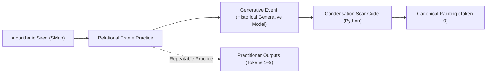
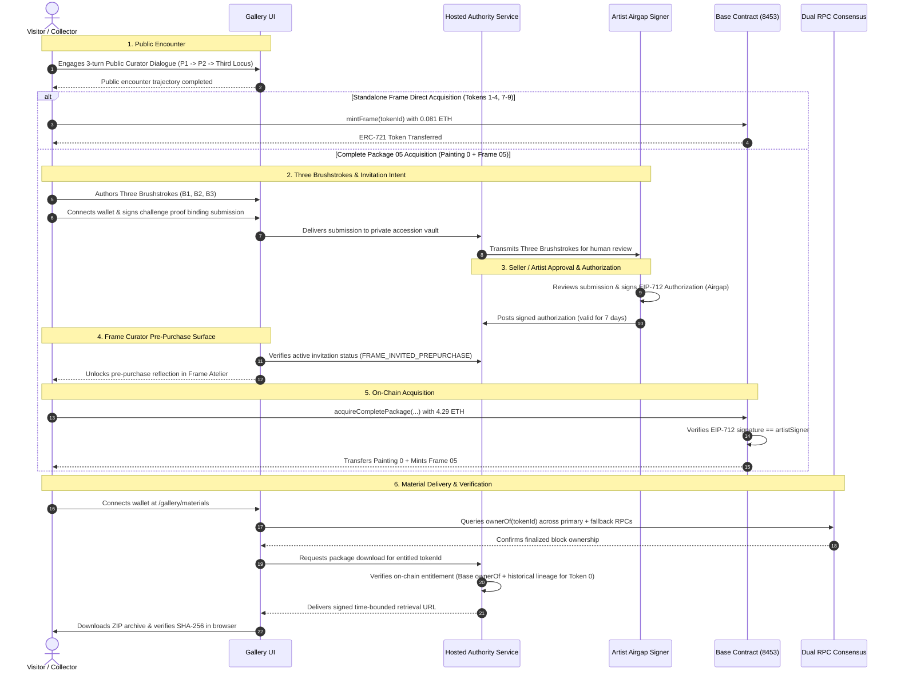

# Hiện Sinh: Protocol Dossier & Ontological Specification
## Technical Architecture, Ontological Boundaries, and Cryptographic Provenance of an Algorithmic Artwork System

**Canonical Document Designation:** `HIEN-SINH-WHITEPAPER-V1-EN`  
**Canonical Governance Notice:** The Vietnamese canonical documentation in `00_PUBLIC/` (`WORK-ONTOLOGY.md`, `CANONICAL-DESIGNATION.md`, `PROVENANCE.md`, `HIEN-SINH_dossier.md`, `VERIFY.md`, `LEGAL-TERMS.md`) is authoritative and governs if any translation or external rendering differs.

---

## 1. Abstract

*Hiện Sinh* (Vietnamese: "Manifestation / Existence") is an algorithmic artwork system comprising nine Frame practices and one canonical Painting, structured through distinct roles for the Artist, algorithmic seeds, AI agents, and human curatorial judgment. It departs from speculative token paradigms by defining a rigorous ontological, cryptographic, and procedural architecture where on-chain tokens act strictly as designation bearers rather than artistic originators.

This document serves as the formal technical and ontological specification of the *Hiện Sinh* artwork system. It delineates the three foundational architectural layers:
1. **Artwork Ontology:** The relational emergence model, the distinction between repeatable Frame practices and the singular canonical Painting embodiment, and the operational constitution of the Curatorial Office.
2. **Protocol & Provenance Layer:** The multi-party state machine governing visitor encounters, the Three Brushstrokes accession ritual, air-gapped Artist authorization ceremony, on-chain execution on Base (ERC-721, Chain ID 8453), and cryptographic root commitments verified via OpenTimestamps on Bitcoin.
3. **Research Lineage:** The technical heritage of Spatial Mapping (SMap) as an algorithmic seed, distinguished from the contingent emergence of the artwork.

Crucially, this specification codifies the formal epistemic boundaries of the system ("What the Protocol Does Not Claim"), ensuring that mathematical verifiability is never conflated with aesthetic resonance, emotional certification, or assertions of synthetic consciousness.

---

## 2. What Hiện Sinh Is

*Hiện Sinh* is neither an autonomous generative machine nor a static NFT collection. It is a formal artwork system investigating the question:

> *“What is the origin of artistic value: the artist, the brush, or the observer’s perception?”*

The system operates across three interconnected entities:
- **The Canonical Painting (Token ID 0):** The physical and digital embodiment of a singular, irreproducible generative event occurring during a historical generative AI session under algorithmic constraint and subsequent code-based condensation.
- **The Nine Frame Practices (Token IDs 1–9):** Nine distinct relational configurations. Each Frame defines a generative grammar (seed context, emotional coordinates, agent/subagent constraints, prompt trajectory, and acceptance criteria) allowing a practitioner to seed, witness, and curate new contingent events (*Outputs*) rather than reproduce copies.
- **The Curatorial Office (Public & Frame Curators):** Bounded conversational companion agents governed by strict epistemological dignities, mediating the threshold between visitor perception, structural evidence, and artistic silence.



---

## 3. Ontology of the Work

### 3.1 Foundational Ontological Chain

The ontology of *Hiện Sinh* is strictly ordered as:

```text
Idea / Seed → Frame → Generative Event → Painting → Recognition & Designation → Encounter → Stewardship
```

1. **Idea / Seed `[Status: SPECIFIED]`:** A conceptual possibility. SMap (Spatial Mapping) provided the spatial and contextual seed. The seed is not the Frame and is not the Painting.
2. **Frame `[Status: DEPLOYED]`:** A configuration of relations enabling symbolic generation. It establishes structural necessity while leaving content contingent.
3. **Generative Event `[Status: VERIFIED]`:** The unrepeatable temporal history of an execution session. It cannot be owned, tokenized, or transferred; only its material and cryptographic traces can be preserved.
4. **Painting `[Status: VERIFIED]`:** The canonical embodiment of one singular event. The image file (`condensed_masterpiece.png`) is its visual core, but the Painting comprises its constitutive traces (scar-code, vector seeds, creation prompts, and designation record).
5. **Recognition, Designation & Transmission `[Status: VERIFIED]`:** The Artist's recognition of artistic value, formal designation of the canonical embodiment via PGP key `D15945BC094633BA1725798C4BD38CB4049EB5D8`, and release into lineage.
6. **Encounter `[Status: DEPLOYED]`:** The lived engagement between a visitor and the transformed Public Encounter Representation.
7. **Stewardship `[Status: SPECIFIED]`:** A relational responsibility assumed by a designated bearer to preserve, display, and transfer the canonical embodiment under the Stewardship Charter.

### 3.2 Necessary Form vs. Contingent Content

A central ontological principle of the system is *hình thức tất yếu, nội dung cơ may* (Necessary Form, Contingent Content):
- **Form (Tất yếu):** The mathematical, spatial, and semantic boundaries enforced by the Frame (viewBox, coordinate constraints, palette rules, multi-agent turns).
- **Content (Cơ may):** The emergent visual and semantic features arising from stochastic generation within those boundaries.

---

## 4. The Emergence / Encounter Model

### 4.1 The Public Encounter Representation

All public visitors and prospective practitioners observe the **Public Encounter Representation** `[Status: DEPLOYED]`. This is an intentionally transformed, obscured visual rendering. 

**Ontological Boundaries:**
- The obscuration is an authentic artistic condition of the threshold, not a paywall, trial version, or corrupted preview.
- Acquiring a Frame does not replace the public image with a clear one; it grants the executable capability to perform the Frame practice.
- The high-resolution canonical visual core is delivered to the entitled bearer of Painting Token 0 in accordance with canonical entitlement, succession, and provenance verification rules (originating through primary acquisition of Complete Package 05 and continuing through subsequent legitimate canonical succession).

### 4.2 Three Brushstrokes vs. Curatorial Dialogue

The protocol strictly separates viewer expression from system response:

| Dimension | Three Brushstrokes (*Ba Vết Cọ*) | Public Curator Dialogue |
| :--- | :--- | :--- |
| **Origin** | Viewer-originated (Human observer) | System-originated (LLM Curatorial Office) |
| **Function** | Accession ritual demonstrating serious encounter | Dialogic companion navigating aesthetic threshold |
| **Structure** | 3 private submissions (B1, B2, B3) to Artist | 3-turn public dialogue (U1 → R1, U2 → R2, U3 → R3) |
| **Retention** | Submitted privately for Artist review | Ephemeral in-session context; not permanently logged |
| **Authority** | Basis for Artist air-gap authorization signature | No authority to grade, certify, or grant access |

---

## 5. P1–P4 Axes and Curatorial Relations

### 5.1 The Four Curatorial Axes (P1–P4)

The generation and curation workflows are organized along four conceptual axes:
- **P1 (Seed / Substrate):** Contextual grounding, origin data, and inherited problem space.
- **P2 (Threshold / Boundary):** Dimensional limits, containment rules, and communicative restraint.
- **P3 (Plurality / Encounter):** Multi-agent tension, divergent perspectives, and visitor resonance.
- **P4 (Condensation / Scar):** Integration of fragments, resolution of failure states, and crystallization of form.

### 5.2 Representation Classes & Information Distribution

Access to information is strictly partitioned across four distinct entitlement tiers, governed by object class rather than numeric P-axes:

```text
+-----------------------------------------------------------------------------------+
| 1. PUBLIC (Public Mediation Level)                                                |
|    - Epistemic Concepts: EPISTEMIC_P1_P2 (Context, seed, threshold boundaries)   |
|    - Scope: Available to all public gallery visitors [Status: DEPLOYED]           |
+-----------------------------------------------------------------------------------+
| 2. FRAME_INVITED_PREPURCHASE (Pre-Purchase Reflection Level)                       |
|    - Epistemic Concepts: EPISTEMIC_P3_P4 (Plurality, condensation, reflection)    |
|    - Scope: Unlocked for authorized wallet prior to acquisition [Status: DEPLOYED] |
+-----------------------------------------------------------------------------------+
| 3. FRAME_HELD_PRACTITIONER (Practitioner Practice Grammar Level)                  |
|    - Artifacts: GENERALIZED_FRAME_TEMPLATE_P1_TO_P4 (Slot substitutions, grammar)  |
|    - Entitlement: Holders of Frame Tokens 1–9 [Status: DEPLOYED]                   |
+-----------------------------------------------------------------------------------+
| 4. COMPLETE_HELD_STEWARD (Canonical Stewardship Level)                            |
|    - Artifacts: ARTIST_L_INSTANCE_P1_TO_P4 & Canonical Visual Core (H_CORE)       |
|    - Entitlement: Holders of Painting Token 0 [Status: VERIFIED]                  |
+-----------------------------------------------------------------------------------+
```

### 5.3 The Seven Dignities of the Curator

The Curatorial Office is bound by a constitutional charter across all relationship tiers:
1. **Sight:** Pointing to structural relations without usurping the visitor's gaze.
2. **Hearing:** Listening to independent resonances without manufacturing or validating them.
3. **Restraint:** Maintaining silence before what lies beyond verifiable evidence.
4. **Hospitality:** Permitting skepticism, indifference, and critique to depart with dignity.
5. **Justice:** Refraining from grading or ranking aesthetic perception.
6. **Fidelity:** Respecting the integrity of a past encounter without demanding mechanical repetition.
7. **Threshold:** Accompanying the visitor through formal dimensions and withdrawing before the totality of the work.

---

## 6. End-to-End State Machine: Public to Delivery

The lifecycle from initial encounter to package delivery follows an inspectable multi-party state machine:



---

## 7. Authority, Cryptographic Proofs, and Evidence Model

*Hiện Sinh* enforces an immutable, additive-only evidence architecture operating across three distinct authority domains:

```text
+------------------------------------------------------------------------------------+
| DOMAIN 1: PRE-RELATIONAL ORIGIN PROVENANCE (Bitcoin & OpenPGP)                     |
| - Authority: Quinn T. OpenPGP Key (D15945BC094633BA1725798C4BD38CB4049EB5D8)      |
| - Origin Payload: ORIGIN-PROVENANCE.json (659 bytes, SHA-256: dac2aef...)          |
| - Detached Signature: ORIGIN-PROVENANCE.json.asc (273 bytes, SHA-256: d3f752e...)  |
| - Temporal Anchors: OpenTimestamps proofs sealed at Bitcoin Blocks #965149/#965152 |
| [Status: VERIFIED]                                                                 |
+------------------------------------------------------------------------------------+
                                         |
                                         v
+------------------------------------------------------------------------------------+
| DOMAIN 2: SMART CONTRACT & DEPLOYMENT (Base Mainnet / EVM)                         |
| - Execution Authority: Artist Signer Wallet (0x3cff39491b333016055B3d9328905B0b...) |
| - Contract Address: 0xdf12fc901934f1ADfBB6e5199B13AC7287dd9FD8 (Chain ID: 8453)   |
| - Deployment Tx: 0x86b58b3707c86b74f52322790dbd51aa188ccf26dbb57d01e5169ac...     |
| - Immutable Designation Hash: 0xed740b4339af1e965723519c7807b5a6184da0f4963f4866...|
| [Status: VERIFIED]                                                                 |
+------------------------------------------------------------------------------------+
                                         |
                                         v
+------------------------------------------------------------------------------------+
| DOMAIN 3: STEWARDSHIP DELIVERY & SHA-256 ROOTS (Local Verification)                |
| - Visual Core Root (H_CORE): 190dfcfc8439c1613c149e72088c0bd32eefa66f2ded7cfb...   |
| - Constitutive Root (H_CONSTITUTIVE): ac49c28e2a857ae06cd64dcf9d9a4c5745ca891b... |
| - Complete Archive Root (H_STEWARDSHIP_ARCHIVE): 7689f75da4ef23bf040ad57f282b24... |
| [Status: VERIFIED]                                                                 |
+------------------------------------------------------------------------------------+
```

---

## 8. On-Chain Representation: ERC-721 on Base

The smart contract `HienSinh.sol` `[Status: DEPLOYED, VERIFIED]` is deployed on Base Mainnet.

### 8.1 Token Identity Specifications

| Token ID | Class | Canonical Designation | Supply | Primary Acquisition | Secondary Transfer Mechanics |
| :---: | :---: | :---: | :---: | :---: | :---: |
| **`0`** | Painting | Canonical Embodiment of *Hiện Sinh* | 1 | 4.29 ETH (via `acquireCompletePackage`) | In-contract `executeSuccession` (≥ 4.29 ETH floor, 1.49% creator fee to Treasury, 98.51% to seller) |
| **`1`** | Frame 01 | Frame Practice Edition 01 | 1 | 0.081 ETH (`mintFrame`) | Standard ERC-721 Transfer (0% royalty, no floor) |
| **`2`** | Frame 02 | Frame Practice Edition 02 | 1 | 0.081 ETH (`mintFrame`) | Standard ERC-721 Transfer (0% royalty, no floor) |
| **`3`** | Frame 03 | Frame Practice Edition 03 | 1 | 0.081 ETH (`mintFrame`) | Standard ERC-721 Transfer (0% royalty, no floor) |
| **`4`** | Frame 04 | Frame Practice Edition 04 | 1 | 0.081 ETH (`mintFrame`) | Standard ERC-721 Transfer (0% royalty, no floor) |
| **`5`** | Frame 05 | Complete Package Frame Edition | 1 | Bundled in Pkg 05 (`acquireCompletePackage`) | Standard ERC-721 Transfer (0% royalty, no floor) |
| **`6`** | Frame 06 | Artist Genesis Frame (Pre-minted) | 1 | Retained by Artist at Genesis | Standard ERC-721 Transfer (0% royalty, no floor) |
| **`7`** | Frame 07 | Frame Practice Edition 07 | 1 | 0.081 ETH (`mintFrame`) | Standard ERC-721 Transfer (0% royalty, no floor) |
| **`8`** | Frame 08 | Frame Practice Edition 08 | 1 | 0.081 ETH (`mintFrame`) | Standard ERC-721 Transfer (0% royalty, no floor) |
| **`9`** | Frame 09 | Frame Practice Edition 09 | 1 | 0.081 ETH (`mintFrame`) | Standard ERC-721 Transfer (0% royalty, no floor) |

### 8.2 Architectural Invariants of the Contract

1. **Token Identity Scope:** The contract defines exactly 10 canonical token identities (`0` through `9`). At deployment, Token 0 (The Painting) and Token 6 (Artist Genesis Frame) were minted directly to the Artist (`totalMinted = 2`). The remaining tokens (`1..5`, `7..9`) are minted according to their respective lifecycle acquisition events. No minting function exists to create additional token IDs beyond this immutable set of 10 identities.
2. **Package 05 Primary Acquisition:** Primary acquisition of Package 05 executes `acquireCompletePackage(...)` under an EIP-712 typed signature from `artistSigner`. It atomically transfers Painting Token 0 from the Artist to the purchaser, mints Frame 05 to the purchaser, records the archive commitment, and permanently releases Painting 0 into the canonical succession regime (`paintingPrimaryReleased = true`). Post-primary, Token 0 and Token 5 circulate independently.
3. **Canonical Succession Floor:** Secondary transfer of Painting Token 0 is restricted exclusively to `executeSuccession(tokenId, recipient)`. Ordinary unapproved ERC-721 transfers are disabled. The caller must be the current owner (`msg.sender == currentOwner`), the recipient cannot be the current owner (`recipient != currentOwner`), the consideration must satisfy ≥ 4.29 ETH (`PAINTING_MINIMUM_SUCCESSION_CONSIDERATION`), and the contract automatically routes a 1.49% (149 BPS) creator royalty to `treasury` while remitting the remaining 98.51% proceeds to the current owner (seller).
4. **SANCTUM Eligibility:** The view function `isSanctumEligible(address)` evaluates to `true` if and only if the querying address simultaneously holds Token 0 and at least one Frame token (1 ≤ ID ≤ 9).

### 8.3 Security Architecture, Multi-Auditor Conformance & Automated Scanner Reconciliation (SolidityScan)

The smart contract `HienSinh.sol` (`0xdf12fc901934f1ADfBB6e5199B13AC7287dd9FD8`) embodies a radical decentralization model: **no admin keys, no proxy upgradability, no mint backdoors, no pausable mechanisms, and no blacklists**.

#### 8.3.1 Automated Scanner Evaluation (SolidityScan QuickScan)
When assessed via **SolidityScan** automated static analysis, the contract achieved:
- **Live Scanner Report:** [SolidityScan QuickScan Report (0xdf12...9FD8)](https://solidityscan.com/quickscan/0xdf12fc901934f1ADfBB6e5199B13AC7287dd9FD8/basescan/mainnet?ref=etherscan)
- **Threat Score:** **`98.5 / 100` — LOW RISK**. The scanner confirmed 28/28 foundational safety invariants, verifying that the contract is not a honeypot, contains no backdoor minting or burning, has zero admin privileges, holds no excess token concentrations, has an immutable fee structure, and matches verified source code byte-for-byte on BaseScan.
- **Security Score:** **`60.68 / 100`**. The reduced score reflects automated heuristic flags designed for centralized DeFi protocols with owner roles. When evaluating an immutable, permissionless ERC-721 art contract with custom succession mechanics, the automated scanner flagged 8 critical-to-medium findings across 5 vulnerability types (6 Critical, 1 High, 1 Medium).

#### 8.3.2 Multi-Auditor Conformance & False Positive Resolution
An adversarial audit conducted by three independent subagents (Alpha, Beta, Gamma) operating under a Zero-Priming Protocol evaluated each finding against deployed EVM bytecode:

| Finding ID | Scanner Classification | Severity | Evaluated Status | Technical Architectural Resolution |
| :---: | :--- | :---: | :---: | :--- |
| **C001** | `CONTROLLED LOW-LEVEL CALL` (1 instance) | Critical | **False Positive** | `treasury` is immutable; `.call{value: ...}("")` routes solely to predetermined Treasury or seller. No arbitrary address injection possible. |
| **C002** | `ERC721 SAFEMINT REENTRANCY` (3 instances) | Critical | **False Positive** | Protected by CEI (state updated prior to mint), `nonReentrant` guard on Package 05, and single-edition token ID bounds (`FrameAlreadyMinted`). |
| **C003** | `INCORRECT ACCESS CONTROL` (2 instances) | Critical | **Architectural Intent** | `mintFrame()` and `executeSuccession()` are intentionally permissionless for public collectors and authentic token owners; zero admin gate is a core design feature. |
| **H001** | `REENTRANCY` (1 instance) | High | **False Positive** | Succession transfer and royalty dispatches are strictly locked by OpenZeppelin `nonReentrant` (`ReentrancyGuard`). |
| **M001** | `SUPPORTSINTERFACE() MAY REVERT` (1 instance) | Medium | **False Positive** | Standard OpenZeppelin ERC-165 / ERC-2981 implementation; returns deterministic booleans without revert risks. |
| **L003/L006** | `PRAGMA / COMPILER VERSION` (4 instances) | Low | **Security Pinning** | Compiler is deterministically pinned to `solc 0.8.28` (Shanghai, 200 runs) to eliminate floating pragma compilation drift. |

For full forensic code dissections, mock attack proofs (`MockMaliciousReceiver.sol`), and the Buyer Operational Safety Checklist, refer to the authoritative disclosure document:
- **Canonical VI:** [`SECURITY-AUDIT-DISCLOSURE.md`](file:///00_PUBLIC/SECURITY-AUDIT-DISCLOSURE.md)
- **Access EN:** [`SECURITY-AUDIT-DISCLOSURE.en.md`](file:///00_PUBLIC/SECURITY-AUDIT-DISCLOSURE.en.md)

---

## 9. Provenance and Canonical Assets

Integrity is validated through explicit SHA-256 cryptographic hashes:

```text
+----------------------------------------------------------------------------------------------------+
| ASSET IDENTIFIER       | TARGET ARTIFACT                  | CANONICAL SHA-256 DIGEST                |
+----------------------------------------------------------------------------------------------------+
| H_CORE                 | condensed_masterpiece.png        | 190dfcfc8439c1613c149e72088c0bd32eefa...|
| H_CONSTITUTIVE         | Python scar-code, prompts, seeds | ac49c28e2a857ae06cd64dcf9d9a4c5745ca89...|
| H_STEWARDSHIP_ARCHIVE  | Complete Stewardship Archive ZIP | 7689f75da4ef23bf040ad57f282b24b84f6ed...|
| DESIGNATION_DOC        | CANONICAL-DESIGNATION.md         | ed740b4339af1e965723519c7807b5a6184da...|
| FRAME_LICENSE          | SCHEDULE-FRAME.md                | bbb9b030f482f5ea365d58eadd13ad48f4357...|
| COMPLETE_LICENSE       | SCHEDULE-COMPLETE.md             | 71d01dbc1962a5cedd1204fe76fa9d538e5d3...|
+----------------------------------------------------------------------------------------------------+
```

---

## 10. SMap as Research Lineage

*Hiện Sinh* emerged from algorithmic research conducted in the open-source project **Spatial Mapping (SMap)** (`https://github.com/thienannguyen-cv/SMap`).

### 10.1 Technical Heritage vs. Artistic Autonomy

- **The Algorithmic Seed:** SMap explored multi-agent coordination, spatial bounding boxes, route geometries, and topological coordinate representations. These technical patterns supplied the formal constraints (the "Frame") for the historical generative session.
- **The Phase Boundary:** While SMap provided the algorithmic grammar, *Hiện Sinh* represents a distinct artistic emergence resulting from a singular human-AI encounter, an unpredicted HTTP 429 interruption, and subsequent Python scar-code condensation.
- **Independence of Rights:** Holding an *Hiện Sinh* Frame or Painting token grants specific material and practice rights under the *Hiện Sinh* license schedules; it **does not transfer copyright, ownership, or licensing rights in the SMap software codebase**.

---

## 11. Privacy and Disclosure Boundaries

To preserve both cryptographic auditability and personal privacy:
1. **Curatorial Ephemerality:** Public Curator conversations are processed in transient runtime memory; chat transcripts are not published in public gallery records.
2. **Accession Confidentiality:** Three Brushstrokes contributions are routed through a private submission channel for Artist review and are not exposed on public gallery surfaces.
3. **Selective Disclosure of Manifests:** Root commitment hashes (`ROOT-COMMITMENTS.json`) are public. Per-file manifest trees and file lists for Frame and Painting packages are revealed exclusively to entitled token bearers upon on-chain entitlement verification.

---

## 12. What the Protocol Does Not Claim (Epistemic Boundaries)

To maintain scientific and philosophical integrity, the *Hiện Sinh* protocol establishes explicit negative boundaries:

```text
===================================================================================================
                               WHAT THE PROTOCOL DOES NOT CLAIM
===================================================================================================

1. NO CLAIM OF SYNTHETIC CONSCIOUSNESS OR INTERIORITY
   The phrase "the first encounter" is an artist-defined ontological metaphor and role
   attribution. The protocol makes NO scientific or philosophical claim that any underlying model,
   historical agent, or Large Language Model possesses consciousness, subjective experience, sentience,
   qualia, intent, or legal personhood.

2. COMPLETION DOES NOT EQUAL RESONANCE
   Completing a 3-turn Public Curator dialogue or submitting Three Brushstrokes records only
   the formal execution of an encounter trajectory. The protocol CANNOT certify that a visitor
   experienced genuine aesthetic resonance, emotional depth, or understanding.

3. INVITATION DOES NOT EQUAL OWNERSHIP
   Receiving an Artist authorization signature following Three Brushstrokes review is an invitation
   to acquire; it does not confer legal, technical, or moral ownership until on-chain execution occurs.

4. ON-CHAIN OWNERSHIP DOES NOT EQUAL LIVED STEWARDSHIP
   Holding Token ID 0 in a wallet records legal/technical designation under the contract. The protocol
   makes no claim that technical custody automatically produces responsible, lived stewardship.

5. CURATOR DIALOGUE DOES NOT CERTIFY TRUTH OR DOGMA
   The Curatorial Office is a bounded conversational companion. The Curator's statements do not
   represent institutional dogma, objective historical truth, or graded evaluations of the visitor.

6. BLOCKCHAIN IMMUTABILITY DOES NOT PROVE ARTISTIC VALUE
   The deployment of smart contracts on Base and the anchoring of hashes on Bitcoin verify data
   integrity, timestamping, and ledger state. They do NOT constitute proof of artistic quality,
   cultural significance, historical importance, or future financial valuation.

7. RESEARCH LINEAGE DOES NOT MECHANICALLY PRODUCE ART
   The existence of SMap code and algorithms is the necessary formal substrate; it did not
   mechanically determine the aesthetic outcome of the canonical Painting.

===================================================================================================
```

---

## 13. Contract, Provenance & Verification References

### 13.1 Live Canonical Coordinates

- **Blockchain Network:** Base Mainnet (Chain ID: `8453`)
- **Smart Contract Address:** [`0xdf12fc901934f1ADfBB6e5199B13AC7287dd9FD8`](https://basescan.org/address/0xdf12fc901934f1ADfBB6e5199B13AC7287dd9FD8#code)
- **Deployment Transaction:** `0x86b58b3707c86b74f52322790dbd51aa188ccf26dbb57d01e5169ac35a97ef88`
- **Deployment Block:** `50822692`
- **Contract Verification Status:** Exact Match (Solc `0.8.28+commit.7893614a`, Shanghai, 200 runs)
- **BaseScan Token Tracker:** [HienSinh (HS)](https://basescan.org/token/0xdf12fc901934f1ADfBB6e5199B13AC7287dd9FD8)

### 13.2 Public Infrastructure & Repositories

- **Official Web Domain:** [https://smapworks.art](https://smapworks.art)
- **Interactive Gallery:** [https://smapworks.art/gallery](https://smapworks.art/gallery)
- **Materials Retrieval Terminal:** [https://smapworks.art/gallery/materials](https://smapworks.art/gallery/materials)
- **Public Verification & Identity Bridge:** [https://smapworks.art/project-contact](https://smapworks.art/project-contact)
- **Open-Source Gallery Repository:** [https://github.com/thienannguyen-cv/hien-sinh-gallery](https://github.com/thienannguyen-cv/hien-sinh-gallery)
- **Open-Source Research Repository (SMap):** [https://github.com/thienannguyen-cv/SMap](https://github.com/thienannguyen-cv/SMap)

---

## 14. Glossary

- **Atelier:** The gallery room hosting the nine Frame encounters and their practice configurations.
- **Ba Vết Cọ (Three Brushstrokes):** Three visitor-authored encounter statements required for Artist review prior to Complete Package acquisition.
- **Canonical Embodiment:** The designated authentic manifestation of the artwork, comprising its visual core and constitutive evidentiary traces.
- **Curatorial Office:** The conversational companion system instantiated as Public Curator and Frame Curator, governed by the Seven Dignities.
- **Dossier:** The exhibition space and documentation set establishing legal perimeter, technical coordinates, pricing, and provenance.
- **Frame (Khung):** A repeatable symbolic practice configuration establishing necessary constraints for generative encounters.
- **Output:** A self-created visual/textual artifact produced by a practitioner exercising a Frame.
- **Sanctum:** A contract-verified status unlocked when an address concurrently holds Painting Token 0 and any Frame Token 1–9.
- **Scar-Code (Mã Vết Sẹo):** The Python consolidation code produced to synthesize image fragments following generative interruption.
- **Steward:** The designated bearer of Complete Package 05 charged with preserving and continuing the lineage of the canonical Painting.
- **Threshold (Ngưỡng):** The entry point of the exhibition presenting public representations under curatorial accompaniment.
