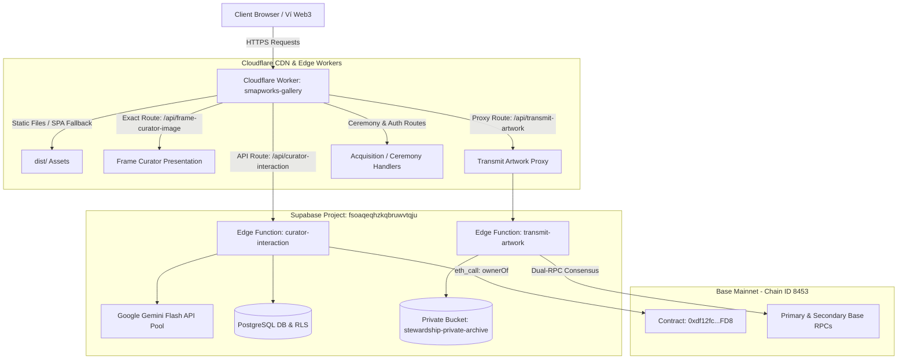

# Hướng Dẫn Triển Khai Production (Production Deployment Guide)
## Dự Án: Hiện Sinh — Gallery (`smapworks.art`)

Tài liệu này cung cấp quy trình chuẩn từng bước (SOP - Standard Operating Procedure) để triển khai toàn bộ hệ thống từ đầu đến cuối một cách an toàn, tin cậy và không gây gián đoạn hay xung đột kiến trúc.

---

## 1. Tổng Quan Kiến Trúc & Cấu Trúc Thành Phần

Hệ thống triển lãm `smapworks.art` bao gồm 5 thành phần chính hoạt động độc lập và liên kết qua các ranh giới bảo mật nghiêm ngặt:



### Các Nguyên Tắc Bất Biến (Security Invariants)
1. **Smart Contract bất biến**: Địa chỉ contract `0xdf12fc901934f1ADfBB6e5199B13AC7287dd9FD8` trên Base Mainnet đã đóng băng vĩnh viễn (frozen). Không sửa đổi hoặc can thiệp on-chain.
2. **Zero-Cookie**: Không sử dụng session cookie hoặc tracking cookie trong toàn bộ runtime công khai.
3. **Không rò rỉ Secret vào Client**: Thư mục `dist/` do Vite đóng gói không chứa bất kỳ private key, service role key, Gemini key hay secret nào. Biến `__HIEN_SINH_LOCAL_PRESENTATION_ENABLED__` luôn là `false` trong build production.
4. **Bảo mật Multi-turn Curator**: Turn 1 sinh cryptographic HMAC-SHA256 seal đóng dấu lịch sử đối thoại. Turn 2 và Turn 3 phía server bắt buộc phải xác thực seal này trước khi gọi tiếp LLM. Giao diện người dùng hiển thị nhãn chuẩn hóa `[FRAME CURATOR]`.

---

## 2. Yêu Cầu Tiền Đề & Chuẩn Bị Môi Trường

### 2.1. Công Cụ Cần Thiết
- **Node.js**: Phiên bản 20.x hoặc 22.x trở lên.
- **npm**: Đi kèm với Node.js.
- **Supabase CLI**: Đã cài đặt qua npm (`npx supabase` hoặc cài global).
- **Cloudflare Wrangler CLI**: Đã cài đặt qua npm (`npx wrangler` hoặc cài global).
- **Git**: Đang checkout nhánh `main` của dự án.

> [!IMPORTANT]
> **Lưu ý trên Windows PowerShell**:
> Khi chạy các lệnh CLI trên Windows PowerShell, nếu gặp lỗi `PSSecurityException` do execution policy chặn script `.ps1`, hãy luôn sử dụng cú pháp:
> - `npm.cmd run ...` thay vì `npm run ...`
> - `npx.cmd supabase ...` thay vì `npx supabase ...`
> - `npx.cmd wrangler ...` thay vì `npx wrangler ...`

### 2.2. Kiểm Tra Quyền & Đăng Nhập
Trước khi thực hiện triển khai, mở terminal tại thư mục dự án `gallery/`:

```powershell
cd "c:\Users\Admin\Downloads\Commercial Images\_Package\Hien Sinh\_operator_DO-NOT-PUBLISH\gallery"
```

1. **Kiểm tra đăng nhập Cloudflare**:
   ```powershell
   npx.cmd wrangler whoami
   ```
   *Yêu cầu*: Hiển thị tài khoản Cloudflare hợp lệ có quyền deploy worker `smapworks-gallery`.

2. **Kiểm tra đăng nhập Supabase**:
   ```powershell
   npx.cmd supabase projects list
   ```
   *Yêu cầu*: Thấy project ID `fsoaqeqhzkqbruwvtqju` trong danh sách, hoặc biến môi trường `SUPABASE_ACCESS_TOKEN` đã được thiết lập.

---

## 3. Quản Lý Secrets & Biến Môi Trường

### 3.1. Supabase Edge Functions Secrets
Các secret sau phải có sẵn trên Supabase Project (`fsoaqeqhzkqbruwvtqju`):

| Tên Secret | Mục Đích |
| :--- | :--- |
| `GEMINI_API_KEY` | Khóa API Gemini chính (Google AI Studio) |
| `CURATOR_PROVIDER_01_KEY` | Khóa dự phòng pool 1 (xoay vòng khi bị rate limit 429/503) |
| `CURATOR_PROVIDER_02_KEY` | Khóa dự phòng pool 2 |
| `CURATOR_PROVIDER_03_KEY` | Khóa dự phòng pool 3 |
| `HIEN_SINH_ENCOUNTER_SECRET` | Khóa bí mật ký HMAC state seal cho Frame Curator |
| `BASE_RPC_URL_PRIMARY` | RPC endpoint Base Mainnet độc lập 1 (Alchemy / QuickNode / Infura) |
| `BASE_RPC_URL_SECONDARY` | RPC endpoint Base Mainnet độc lập 2 (khác provider 1) |
| `SUPABASE_SERVICE_ROLE_KEY` | Khóa nội bộ Supabase để xác thực RLS |

*Để cập nhật secret lên Supabase (nếu cần)*:
```powershell
npx.cmd supabase secrets set GEMINI_API_KEY="AIzaSy..." --project-ref fsoaqeqhzkqbruwvtqju
```

### 3.2. Cloudflare Worker Configuration
File cấu hình nằm tại `gallery/cloudflare/smapworks/wrangler.toml`:
```toml
name = "smapworks-gallery"
main = "_worker.js"
compatibility_date = "2024-09-23"
compatibility_flags = [ "nodejs_compat" ]
workers_dev = true

[assets]
directory = "../../dist"
binding = "ASSETS"
not_found_handling = "single-page-application"
run_worker_first = true

[vars]
SUPABASE_URL = "https://fsoaqeqhzkqbruwvtqju.supabase.co"
ARCHIVE_TRANSMISSION_URL = "https://fsoaqeqhzkqbruwvtqju.supabase.co/functions/v1/transmit-artwork"
SUPABASE_ANON_KEY = "eyJhbGciOiJIUzI1NiIsInR5cCI6IkpXVCJ9..."
```

---

## 4. Quy Trình Triển Khai Chi Tiết (Step-by-Step)

Quy trình triển khai bắt buộc phải tuân theo thứ tự 4 bước nghiêm ngặt dưới đây:

### Bước 1: Kiểm Tra Tính Toàn Vẹn & Build Thử Nghiệm (Pre-Deploy Gate)

Trước khi gửi bất kỳ thay đổi nào lên server, bắt buộc chạy kiểm thử bảo mật và build:

```powershell
# 1. Chạy toàn bộ 134 bài kiểm thử bảo mật tự động
npm.cmd run security:test
```
*Tiêu chuẩn đạt*: Toàn bộ kiểm thử báo PASS (`# pass 134`, `# fail 0`). Không được bỏ qua bất kỳ bài test nào.

```powershell
# 2. Biên dịch production và tạo staging assets
npm.cmd run build
```
*Tiêu chuẩn đạt*: 
- Script kiểm tra ABI contract và tọa độ release hoàn tất.
- TypeScript biên dịch không lỗi (`tsc -b`).
- Vite bundle thành công vào thư mục `dist/`.
- `copy-internal-assets.mjs` sao chép các asset nội bộ an toàn.
- `assert-production-clean.mjs` xác nhận không có cờ dev/preview/debug rò rỉ.

---

### Bước 2: Triển Khai Database Migration Lên Supabase (Nếu Có Migration Mới)

Nếu có file migration mới trong thư mục `supabase/migrations/`:

```powershell
# Đẩy migration lên database production
npx.cmd supabase db push --project-ref fsoaqeqhzkqbruwvtqju
```

> [!WARNING]
> Không bao giờ tự ý sửa hoặc xóa các migration đã chạy trong quá khứ (`01`, `02`, `03_archive_security_lockdown.sql`). Mọi thay đổi cấu trúc bảng, RLS hoặc hàm PL/pgSQL phải tạo migration timestamp mới.

---

### Bước 3: Triển Khai Supabase Edge Function (`curator-interaction`)

Edge Function phụ trách xử lý đối thoại AI với Gemini và xác thực cryptographic HMAC seal.

1. **Kiểm tra cấu hình bundle**:
   Đảm bảo file `supabase/config.toml` đã khai báo bundle các file ngữ cảnh tiếng Việt chuẩn tắc:
   ```toml
   [functions.curator-interaction]
   static_files = [
     "./functions/curator-interaction/contexts/CONTEXT-CORE.vi.md",
     "./functions/curator-interaction/contexts/CONTEXT-FRAME.vi.md",
     "./functions/curator-interaction/contexts/CONTEXT-PUBLIC.vi.md"
   ]
   ```

2. **Chạy lệnh deploy**:
   ```powershell
   npx.cmd supabase functions deploy curator-interaction --no-verify-jwt --project-ref fsoaqeqhzkqbruwvtqju
   ```

3. **Xác nhận triển khai**:
   CLI sẽ in ra thông báo:
   ```text
   Deployed Function curator-interaction on project fsoaqeqhzkqbruwvtqju
   ```

---

### Bước 4: Triển Khai Cloudflare Worker & Static Assets (`smapworks.art`)

Sau khi `dist/` đã được build mới nhất từ Bước 1, tiến hành deploy lên Cloudflare:

```powershell
# Di chuyển vào thư mục worker của smapworks
cd cloudflare/smapworks

# Triển khai lên Cloudflare
npx.cmd wrangler deploy

# Quay trở lại thư mục gốc gallery
cd ../..
```

*Tiêu chuẩn đạt*: 
- Wrangler upload thành công các static assets trong `dist/`.
- Worker `smapworks-gallery` được gắn phiên bản mới nhất tại route production `https://smapworks.art`.

---

## 5. Post-Deployment Verification (5 Cổng Kiểm Tra Chất Lượng Live)

Sau khi deploy hoàn tất, thực hiện kiểm tra 5 cổng (smoke test) trực tiếp trên domain live:

### Cổng 1: Static Assets & Cơ Chế SPA Navigation
Kiểm tra trang chủ và điều hướng client-side:
- Mở `https://smapworks.art` trên trình duyệt: giao diện tải mượt mà, không có lỗi console 404/500.
- Truy cập trực tiếp link con `https://smapworks.art/gallery`: Cloudflare Worker phải trả về HTTP 200 kèm `index.html` (SPA fallback), không bị 404.
- Kiểm tra chặn asset nhạy cảm: Truy cập `https://smapworks.art/_internal_assets/frame-curator-baseline.png` phải trả về đúng HTTP 404 (bị Worker chặn theo thiết kế).

### Cổng 2: Delivery Endpoint Ảnh Frame Curator
Chạy lệnh kiểm tra header và cache:
```powershell
curl -I https://smapworks.art/api/frame-curator-image
```
*Kết quả đạt*:
- HTTP 200 OK.
- `content-type: image/png`.
- `cache-control: private, no-store`.

### Cổng 3: Acquisition Authorization Endpoint
Kiểm tra endpoint cấp quyền mua:
```powershell
curl -X POST https://smapworks.art/api/acquisition-authorization -H "content-type: application/json" -d "{}"
```
*Kết quả đạt*:
- HTTP 200 OK.
- Trả về JSON `{ "status": "NOT_ISSUED" }`.
- Header tuyệt đối không có `set-cookie`.

### Cổng 4: Public Curator Interaction (Khách Thăm Quan Công Cộng)
Gửi truy vấn công cộng lên API Curator:
```powershell
curl -X POST https://smapworks.art/api/curator-interaction `
  -H "content-type: application/json" `
  -H "sec-fetch-site: same-origin" `
  -d '{\"surface\":\"PUBLIC_CURATOR\",\"relationship\":\"PUBLIC\",\"trigger\":\"P1\",\"dialogue\":[{\"role\":\"visitor\",\"content\":\"Hello\"}]}'
```
*Kết quả đạt*:
- HTTP 200 OK.
- Trả về JSON chứa `content` và `seal: "[PUBLIC CURATOR]"`.

### Cổng 5: Frame Curator Multi-turn & Language Adaptation
Thực hiện tương tác trực tiếp trên giao diện Frame Curator (hoặc gửi payload tương ứng):
1. **Kiểm tra Ngôn ngữ**:
   - Khi khách hỏi bằng tiếng Anh (ví dụ: *"What does this frame represent?"*): Phản hồi từ Curator phải bằng tiếng Anh trôi chảy và tự nhiên, vẫn giữ đúng cốt lõi ngữ nghĩa từ context chuẩn tắc.
2. **Kiểm tra Nhãn Hiển Thị Seal**:
   - Trên giao diện `ArchiveCuratorTerminal`, thẻ phía trên nội dung trả lời phải hiển thị nhãn thanh lịch: `[FRAME CURATOR]`.
   - Chuỗi hex 64 ký tự (HMAC seal) không bị lộ ra giao diện người dùng, nhưng được lưu nguyên vẹn trong state tin nhắn để làm bằng chứng cho lượt thoại kế tiếp (Turn 2, Turn 3).

---

## 6. Xử Lý Sự Cố & Kế Hoạch Rollback (Troubleshooting & Rollback)

### Khi Gemini API Gặp Lỗi 429 Quota Exceeded
Hệ thống Edge Function đã tích hợp cơ chế Key Pooling thông minh và Model Fallback:
- Tự động luân chuyển giữa 4 khóa: `CURATOR_PROVIDER_01_KEY`, `02_KEY`, `03_KEY` và `GEMINI_API_KEY`.
- Tự động fallback giữa các model: `gemini-3.6-flash` → `gemini-2.5-flash` → `gemini-2.0-flash`.
- Nếu tất cả các khóa đều cạn kiệt, kiểm tra và nạp thêm API key mới vào Supabase Secrets.

### Rollback Cloudflare Worker
Nếu bản deploy Cloudflare Worker gặp sự cố:
```powershell
cd cloudflare/smapworks
npx.cmd wrangler rollback
cd ../..
```
Wrangler sẽ lập tức khôi phục về phiên bản worker trước đó mà không cần rebuild.

### Rollback Supabase Edge Function
Nếu Edge Function mới deploy gặp lỗi logic:
1. Sửa lại code trong `supabase/functions/curator-interaction/index.ts`.
2. Chạy lại lệnh deploy:
   ```powershell
   npx.cmd supabase functions deploy curator-interaction --no-verify-jwt --project-ref fsoaqeqhzkqbruwvtqju
   ```

---

## 7. Quy Trình Chuẩn Kiểm Toán Bảo Mật & Quét Bí Mật Trước Khi Commit (Pre-Commit Security & Secret Audit SOP)

Để bảo đảm an toàn tuyệt đối, ngăn chặn triệt để việc rò rỉ các khóa mật mã, private keys, API keys, mã độc hay tài sản chuẩn tắc (`H_CORE`, `H_CONSTITUTIVE`, scar-code) lên repository công khai GitHub, mọi thao tác commit phải tuân thủ nghiêm ngặt quy trình kiểm toán 6 bước sau:

### Bước 7.1: Kiểm toán Ranh giới Tệp & `.gitignore` (Perimeter & Staging Audit)
- Kiểm tra danh sách tệp unversioned và modified bằng:
  ```powershell
  git status -s
  ```
- **Bất biến kiểm toán**:
  - Không bao giờ stage các tệp môi trường cục bộ: `.env`, `.env.*`, `.env.local`, `.env.development.local`, `.env.production.local`.
  - Không stage thư mục build trung gian hoặc state của công cụ: `dist/`, `.wrangler/`, `supabase/.branches/`, `supabase/.temp/`, `_secrets/`, `*.log`.
  - Không stage các tệp nhị phân runtime ngoại tuyến tạm: `deno.exe`, `deno.zip`.

### Bước 7.2: Quét Tự Động Khóa Bí Mật & Chữ Ký (Automated Secret & Key Pattern Scan)
- Thực hiện quét toàn diện regex patterns trên toàn bộ working tree và staged diff:
  1. **Khóa riêng tư mật mã**: `-----BEGIN (RSA|EC|OPENSSH|PGP) PRIVATE KEY-----`
  2. **Ethereum / EVM Private Keys**: Chuỗi hex 64 ký tự `0x[a-fA-F0-9]{64}` (ngoại trừ các test fixture công khai đã được đánh dấu rõ ràng hoặc hash công khai).
  3. **Google Gemini API Keys**: `AIzaSy[a-zA-Z0-9_-]{33}`
  4. **Supabase Service Role / JWT Secret Keys**: Các token JWT có prefix `eyJhbGciOiJIUzI1NiIsInR5cCI6IkpXVCJ9...`
  5. **Worker Secret Keys**: Các giá trị bí mật của biến môi trường `HIEN_SINH_ENCOUNTER_SECRET`.

### Bước 7.3: Kiểm toán Ranh giới Tài sản Tác phẩm (Canonical Artwork Asset Audit)
- Kiểm tra kho lưu trữ không chứa tài sản bảo mật của Bức Tranh hoặc gói bàn giao:
  - Tuyệt đối không chứa `H_CORE` (bản thể hiện lossless canonical).
  - Không chứa `H_CONSTITUTIVE` (lớp cấu thành nguyên bản).
  - Không chứa `scar-code` mật mã của tác phẩm.
  - Không chứa các gói tệp zip bàn giao độc lập (`Frame Practice Archives` của Khung #01–04, #06–09).
- Chạy script xác thực ranh giới sản xuất:
  ```powershell
  node scripts/assert-production-clean.mjs
  ```

### Bước 7.4: Xác minh Tính Toàn Vẹn Hợp Đồng & Tọa Độ Phát Hành (Contract & Release Verification)
- Xác nhận byte-for-byte giao diện hợp đồng smart contract Base Mainnet:
  ```powershell
  node scripts/assert-contract-interface.mjs
  ```
- Kiểm tra tọa độ phát hành khớp với `RELEASE-STATUS.json`:
  ```powershell
  node scripts/export-release-coordinates.mjs --check
  ```

### Bước 7.5: Thực Thi Toàn Bộ Bài Kiểm Thử Bảo Mật (Full Security Test Pass)
- Chạy toàn bộ bộ kiểm thử tự động:
  ```powershell
  npm.cmd run security:test
  ```
  *Tiêu chuẩn bắt buộc*: **139/139 PASS (100%)**, 0 fail, 0 skipped.

### Bước 7.6: Stage Tường Minh & Rà Soát Diff Trước Khi Commit (Explicit Staging & Diff Review)
- Khuyến nghị stage tường minh các tệp cần commit thay vì `git add -A`:
  ```powershell
  git add <tập tin/thư mục cụ thể>
  ```
- Rà soát diff đã stage:
  ```powershell
  git diff --cached --stat
  ```
- Thực hiện commit với thông điệp chuẩn mực tuân theo Conventional Commits.

